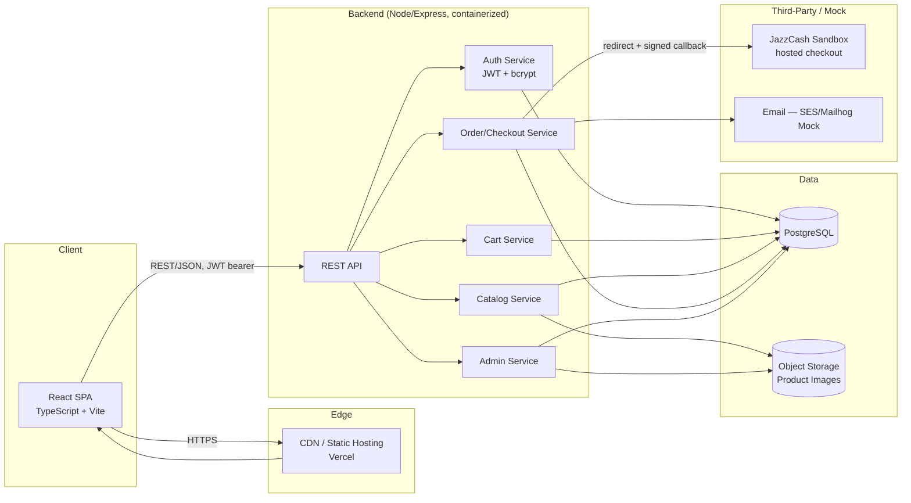
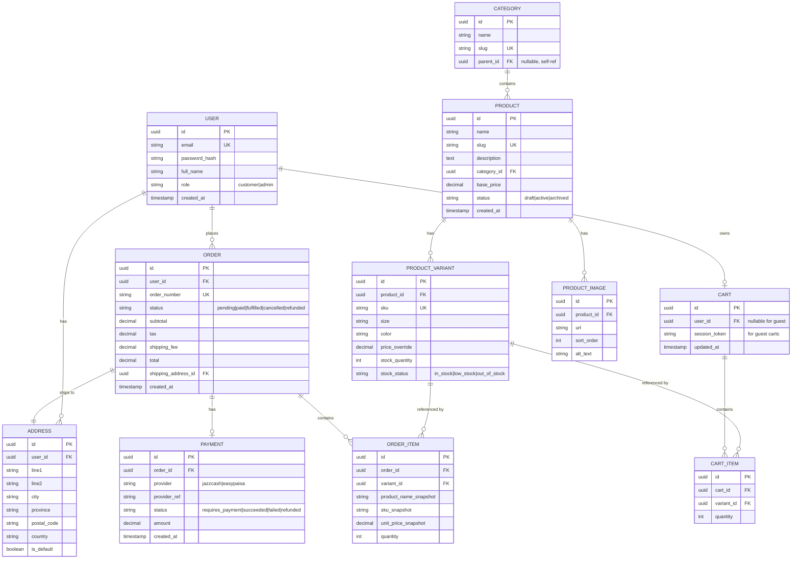

# AbuUbaida — E-Commerce Platform Plan & Architecture

## 1. Assumptions Confirmed / Adjusted

Confirmed as proposed, with these refinements:

| Area | Decision | Note |
|---|---|---|
| Frontend | React 18 + TypeScript + Vite | Vite over CRA (faster builds, active maintenance) |
| Styling | Tailwind CSS + shadcn/ui-style components | Fast, accessible, themeable (dark mode built in) |
| State | React Context + `useReducer` for cart; TanStack Query for server state | Keeps cart persistent + in sync with server for logged-in users |
| Backend | Node.js 20 + Express + TypeScript | Type safety end-to-end |
| DB | PostgreSQL 15 + Prisma ORM | Prisma gives type-safe queries, migrations, and a clean ERD source of truth |
| Auth | JWT (access + refresh tokens), bcrypt password hashing | Refresh token rotated, stored as httpOnly cookie |
| Payments | **JazzCash** sandbox (hosted-checkout redirect) as primary gateway for Pakistan launch | Customer is redirected to JazzCash's page to pay by wallet/card; PCI scope stays minimal since we never touch card/wallet credentials. Easypaisa can be added as a second option in Phase 2 using the same provider-agnostic order/stock logic. |
| Email | AWS SES sandbox (mock) with local dev fallback to console/log + Mailhog | Matches "SNS/mock integration" ask |
| Hosting | Frontend: Vercel/Netlify. Backend: Render/Fly.io or AWS ECS. DB: managed Postgres (RDS/Supabase/Neon) | Chosen for low ops overhead at MVP stage |
| Image storage | S3-compatible bucket (AWS S3 or Cloudflare R2) + CDN | Not local disk — needed for production reliability |
| CI/CD | GitHub Actions | Lint → test → build → deploy |

**Open questions for you to confirm:**
1. Real payment provider for launch (Stripe vs. local gateway e.g. JazzCash/Easypaisa if targeting Pakistan)?
2. Single currency/region at MVP, or multi-currency from day one?
3. Do you have brand assets already, or should the brand package below be treated as a starting concept?

Everything below proceeds on the assumptions table; adjust and I'll rework any section.

---

## 2. System Architecture



**Key decisions**
- Modular monolith at MVP (single Express app, domain-separated route/service folders) — not microservices. Cheaper to build, test, and deploy; can be split later if scale demands.
- Cart persists two ways: `localStorage` for guests (survives refresh/close), synced to a `carts` DB table the moment a user logs in or registers, so it survives across devices once authenticated.
- Stateless API (JWT) so it horizontally scales behind a load balancer without session affinity.

---

## 3. Data Model (ERD)



**Design notes**
- Order items **snapshot** product name/SKU/price at time of purchase — historical orders must not change if a product is later edited or deleted.
- `PRODUCT_VARIANT` is the real sellable unit (size × color combination); `PRODUCT` is the display/marketing entity. Inventory and SKU live on the variant.
- Guest carts use a `session_token` cookie; on login, guest cart items are merged into the user's persistent cart.

---

## 4. API Contract (MVP)

Base URL: `/api/v1`. All authenticated routes require `Authorization: Bearer <access_token>`. Standard error shape:
```json
{ "error": { "code": "VALIDATION_ERROR", "message": "Email is required", "fields": { "email": "required" } } }
```

### Auth
| Method | Path | Body | Response |
|---|---|---|---|
| POST | `/auth/register` | `{ email, password, fullName }` | `201 { user, accessToken }` (+ refresh cookie) |
| POST | `/auth/login` | `{ email, password }` | `200 { user, accessToken }` |
| POST | `/auth/refresh` | (refresh cookie) | `200 { accessToken }` |
| POST | `/auth/logout` | — | `204` |
| GET  | `/auth/me` | — | `200 { user }` |

### Catalog
| Method | Path | Query/Body | Response |
|---|---|---|---|
| GET | `/products` | `?category=&q=&size=&color=&minPrice=&maxPrice=&sort=price_asc\|price_desc\|newest&page=&limit=` | `200 { items[], page, total }` |
| GET | `/products/:slug` | — | `200 { product, variants[], images[] }` |
| GET | `/categories` | — | `200 { categories[] }` (tree) |
| GET | `/products/:id/recommendations` | — | `200 { items[] }` (same-category, in-stock, excluding self) |

### Cart
| Method | Path | Body | Response |
|---|---|---|---|
| GET | `/cart` | — | `200 { cart }` |
| POST | `/cart/items` | `{ variantId, quantity }` | `200 { cart }` |
| PATCH | `/cart/items/:itemId` | `{ quantity }` | `200 { cart }` |
| DELETE | `/cart/items/:itemId` | — | `200 { cart }` |
| POST | `/cart/merge` | `{ guestSessionToken }` | `200 { cart }` (called right after login) |

### Checkout / Orders (JazzCash redirect flow)
| Method | Path | Body | Response |
|---|---|---|---|
| POST | `/checkout/intent` | `{ addressId, customerMobile }` | `200 { orderId, actionUrl, fields }` — creates pending order; frontend auto-submits a hidden form with `fields` to `actionUrl` (JazzCash's hosted page) |
| POST | `/checkout/callback/jazzcash` | *(JazzCash-signed form POST, not called by our frontend)* | `302 redirect` to `/order-confirmation/:id` or `/checkout/failed` — verifies secure hash, decrements stock transactionally, marks order paid, sends confirmation email |
| GET | `/checkout/status/:orderId` | — | `200 { status }` — polled by the confirmation page while waiting for the callback to land |
| GET | `/orders` | — | `200 { orders[] }` (current user's history) |
| GET | `/orders/:id` | — | `200 { order, items[] }` |

### Admin (role: admin)
| Method | Path | Body | Response |
|---|---|---|---|
| POST | `/admin/products` | product + variants payload | `201 { product }` |
| GET | `/admin/products/:id` | — | `200 { product }` (by id, includes draft/archived — unlike public slug lookup) |
| PUT | `/admin/products/:id` | — | `200 { product }` |
| DELETE | `/admin/products/:id` | — | `204` (soft delete → status: archived) |
| PATCH | `/admin/variants/:id/stock` | `{ stockQuantity }` | `200 { variant }` |
| GET | `/admin/orders` | `?status=` | `200 { orders[] }` |
| PATCH | `/admin/orders/:id/status` | `{ status }` | `200 { order }` |
| GET | `/admin/dashboard` | — | `200 { totalRevenue, ordersByStatus, lowStockVariants[] }` |

All list endpoints are paginated (`page`, `limit`, default 20, max 100). All mutating endpoints validate payloads with Zod schemas and return `422` on validation failure.

---

## 5. Project Structure

```
abuubaida/
├── backend/
│   ├── src/
│   │   ├── routes/          # auth.routes.ts, products.routes.ts, cart.routes.ts, checkout.routes.ts, admin.routes.ts
│   │   ├── controllers/     # thin request handlers
│   │   ├── services/        # business logic (orderService, cartService, stockService)
│   │   ├── middleware/      # auth.middleware.ts, error.middleware.ts, validate.middleware.ts
│   │   ├── models/          # Prisma client + schema.prisma
│   │   ├── lib/             # stripe.ts, email.ts, s3.ts
│   │   └── app.ts, server.ts
│   ├── prisma/schema.prisma
│   ├── tests/
│   ├── .env.example
│   └── Dockerfile
├── frontend/
│   ├── src/
│   │   ├── components/      # ProductCard, Filters, CartDrawer, SizeSelector...
│   │   ├── context/          # CartContext.tsx, AuthContext.tsx
│   │   ├── pages/            # Home, Catalog, ProductDetail, Cart, Checkout, Account, Admin/*
│   │   ├── api/               # typed API client (fetch wrappers)
│   │   └── main.tsx, App.tsx
│   ├── .env.example
│   └── Dockerfile
├── docker-compose.yml        # postgres + backend + frontend for local dev
└── .github/workflows/ci.yml
```

---

## 6. Non-Functional Requirements

- **Security**: bcrypt (cost 12) for passwords; helmet + CORS allowlist; rate limiting on `/auth/*` (express-rate-limit); parameterized queries via Prisma (no raw SQL injection surface); input validation with Zod on every mutating route; HTTPS-only cookies for refresh token; CSRF not needed for pure bearer-token API but cookie endpoints get `SameSite=Strict`.
- **Validation & error handling**: centralized error middleware mapping known error classes (`ValidationError`, `NotFoundError`, `AuthError`, `ConflictError`) to HTTP codes; all async route handlers wrapped to forward to error middleware.
- **Analytics (basic)**: server-side event log table (`page_view`, `add_to_cart`, `purchase`) + optional Plausible/GA4 on frontend; admin dashboard shows revenue/day, top products, conversion funnel (cart → checkout → paid).
- **Testing**: Vitest/Jest unit tests for services (cart math, stock decrement, order totals); Supertest for API integration tests; Playwright for a smoke E2E (browse → add to cart → checkout with Stripe test card).
- **CI/CD (GitHub Actions)**: on PR — lint, typecheck, unit tests; on merge to `main` — build Docker images, run migrations, deploy backend, deploy frontend, run smoke test against staging.

---

## 7. Phased Roadmap

### Phase 1 — MVP (target: 6–8 weeks, 1–2 devs)
1. Repo scaffolding, CI pipeline, Docker Compose local env
2. DB schema + migrations (Prisma), seed script with sample AbuUbaida catalog
3. Auth (register/login/refresh/me) + role-based middleware
4. Catalog: list/detail/category/search/filter/sort
5. Cart: guest + persistent, merge-on-login
6. Checkout: JazzCash sandbox redirect flow + signed callback verification, transactional stock decrement
7. Order confirmation email (mock SES/Mailhog)
8. Admin panel: product CRUD, variant/stock management, order list + status update
9. Basic recommendations (same-category, in-stock)
10. Deploy to staging; smoke tests pass

**Exit criteria**: a customer can browse → filter → add to cart → register/login → checkout with a Stripe test card → receive confirmation email → see order in history; an admin can add a product with variants and see the resulting order.

### Phase 2 — Post-MVP Enhancements (weeks 9–14)
- Wishlist / save-for-later
- Product reviews & ratings
- Discount codes / promotions engine
- Add Easypaisa as a second local gateway option alongside JazzCash; add Stripe if/when international sales are needed
- Address book (multiple saved addresses)
- Real transactional email provider (SES production) + templated emails (order shipped, back-in-stock)
- Improved recommendations (collaborative filtering / "frequently bought together")
- Admin analytics dashboard (revenue, top SKUs, low-stock alerts)
- Image optimization pipeline (responsive sizes, WebP) via S3 + CDN

### Phase 3 — Scale & Polish (weeks 15+)
- Multi-currency / multi-region pricing
- CMS-driven landing pages / lookbooks for seasonal drops
- Loyalty program / referral codes
- A/B testing framework for merchandising
- Search upgrade (Postgres full-text → Meilisearch/Algolia if catalog grows large)
- SRE hardening: autoscaling, read replicas, CDN cache tuning, structured logging + tracing (OpenTelemetry)

---

## 8. Deployment & Run Instructions

### Local development
```bash
git clone <repo> && cd abuubaida
cp backend/.env.example backend/.env
cp frontend/.env.example frontend/.env
docker compose up -d          # starts postgres
cd backend && npm install && npx prisma migrate dev && npm run seed && npm run dev
cd ../frontend && npm install && npm run dev
```
Backend on `http://localhost:4000`, frontend on `http://localhost:5173`, Mailhog UI on `http://localhost:8025` for viewing mock emails.

### Production (example: Render + Vercel + Neon Postgres)
```bash
# Backend (Render / Fly.io / ECS)
docker build -t abuubaida-api ./backend
# set env vars: DATABASE_URL, JWT_ACCESS_SECRET, JWT_REFRESH_SECRET,
# JAZZCASH_MERCHANT_ID, JAZZCASH_PASSWORD, JAZZCASH_INTEGRITY_SALT, JAZZCASH_RETURN_URL,
# SES_* or SMTP_*, S3_BUCKET, S3_REGION, CORS_ORIGIN, FRONTEND_URL
npx prisma migrate deploy
docker run -p 4000:4000 abuubaida-api

# Frontend (Vercel)
vercel --prod          # set VITE_API_BASE_URL to backend URL
```

CI/CD (`.github/workflows/ci.yml`) runs lint/typecheck/test on every PR, and on merge to `main` builds and pushes the backend image, runs `prisma migrate deploy` against the production DB, and triggers the Vercel deploy hook for the frontend.

---

See companion files for: brand package, SQL schema, and MVP code snippets (auth, product CRUD, cart, checkout).
